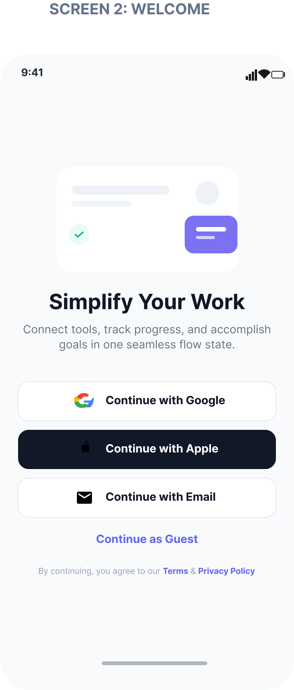

# 📱 Task 1 — Mobile Signup & Onboarding Flow

**A premium mobile authentication & onboarding UI Kit featuring high-fidelity screens, a complete design system, and interactive prototype flows.**

---

## 🎯 Objective

Design a modern, intuitive mobile signup and login flow that provides a seamless first-time user experience. The goal is to reduce onboarding friction and maximize conversion from install to active user.

---

## ✨ Features

- **Splash Screen** — Animated brand introduction with logo reveal
- **Onboarding Carousel** — 3-step value proposition walkthrough with skip option
- **Login Screen** — Email/password login with social authentication (Google, Apple)
- **Signup Screen** — Clean registration form with real-time field validation
- **OTP Verification** — 4-digit code input with auto-focus and resend timer
- **Password Recovery** — Email-based reset flow
- **Welcome Screen** — Personalized greeting after successful onboarding

---

## 🔄 Design Process

| Phase | Description |
|-------|-------------|
| **Research** | Competitive analysis of top SaaS mobile apps (Notion, Slack, Linear) |
| **Wireframes** | Low-fidelity sketches exploring layout hierarchy and user flow |
| **UI Design** | High-fidelity screens with consistent design tokens and component library |
| **Prototyping** | Interactive Figma prototype with Smart Animate transitions |
| **Testing** | Usability review and iteration based on heuristic evaluation |

---

## 🛠️ Tools Used

| Tool | Purpose |
|------|---------|
| **Figma** | UI Design, Prototyping, Component System |
| **FigJam** | Brainstorming & User Flow Mapping |
| **Stark Plugin** | Accessibility & Contrast Checking |

---

## 📸 Screenshots

> Add your screen captures below. Place PNG/JPG files in the `Screenshots/` folder.

| Screen | Preview |
|--------|---------|
| Splash |  |
| Onboarding |  |
| Login |  |
| Signup |  |
| OTP |  |
| Welcome |  |

---

## 🔗 Figma Link

> 📎 Open the live Figma prototype:
> 
> **[View Figma File →]()**
> 
> *(Replace with your actual Figma share link)*

See also: [`Figma-Link.txt`](./Figma-Link.txt)

---

## 👤 Author

| Detail | Info |
|--------|------|
| **Name** | Noor Mohamed Halith |
| **Program** | CODSOFT UI/UX Design Internship |
| **Task** | Task 1 — Mobile Signup & Onboarding Flow |

---

*CODSOFT UI/UX Internship · Task 1*

