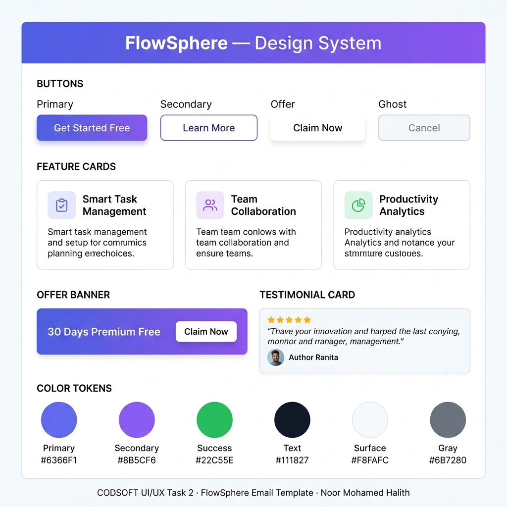

# FlowSphere — Premium Responsive Email Template Design System & Case Study

<div align="center">




**A high-fidelity welcome and product launch email system for FlowSphere — a modern SaaS productivity tool. Built with fluid layouts, interactive components, token-based design system, and full UX case study.**

[🌐 View Case Study](./Case-Study/case-study.md) · [📱 Launch Interactive Prototype](./prototype.html) · [🎨 Figma Specs](./Figma/figma-specs.md)

</div>

---

## 🚀 Interactive Prototype

The project includes a high-fidelity **interactive prototype simulator** with a viewport toggle to test desktop (640px) vs mobile (375px) client behaviors.

👉 **[Launch Interactive Prototype Simulator](./prototype.html)**

### Interactive Flow Features:
- **Desktop/Mobile Toggle:** Test responsive layout transformations.
- **Pulsing Hotspot Highlights:** Quickly find and click interactive regions.
- **7 Fully Responsive Modals:**
  - **Success Overlay:** Get Started CTA signup celebration.
  - **30-Day Offer Pop-up:** Running countdown timer (loss aversion design).
  - **Download Badges:** QR Code overlays for Android and iOS app downloads.
  - **Privacy & Terms:** Scrollable documents inside the prototype.
  - **Feedback Unsubscribe:** Survey feedback popup on cancel.

---

## 📁 16-Page Figma SVG Case Study

Each Figma page is generated as a separate vector SVG with structured grouping layers for easy import:

1. **[01 - Cover](./Figma/Page-01-Cover.svg):** Portfolio presentation page cover.
2. **[02 - Overview](./Figma/Page-02-Project-Overview.svg):** Brief, timeline, tools, and design process.
3. **[03 - UX Research](./Figma/Page-03-UX-Research.svg):** Methodologies and competitive analysis table.
4. **[04 - Personas](./Figma/Page-04-User-Personas.svg):** 2 detailed startup personas.
5. **[05 - Journey Map](./Figma/Page-05-User-Journey.svg):** 5-stage customer journey diagram.
6. **[06 - Information Architecture](./Figma/Page-06-Information-Architecture.svg):** Site sitemap hierarchy map.
7. **[07 - User Flow](./Figma/Page-07-User-Flow.svg):** Interactive decision node chart.
8. **[08 - Low-Fi Wireframes](./Figma/Page-08-Lofi-Wireframes.svg):** Gray block desktop & mobile wireframes.
9. **[09 - Mid-Fi Blueprints](./Figma/Page-09-Midfi-Wireframes.svg):** Layout spec blueprints.
10. **[10 - Hi-Fi Desktop](./Figma/Page-10-HiFi-Desktop.svg):** 640px email rendering with side specs.
11. **[11 - Hi-Fi Mobile](./Figma/Page-11-HiFi-Mobile.svg):** 375px mobile view centered.
12. **[12 - Component Sheet](./Figma/Page-12-Components.svg):** Buttons, feature cards, testimonials assets.
13. **[13 - Variant Grid](./Figma/Page-13-Component-Variants.svg):** States variants matrix table (Default, Hover, Active, Disabled).
14. **[14 - Tokens System](./Figma/Page-14-Design-System.svg):** Colors hex, type scale, spacing tokens.
15. **[15 - Prototype Connections](./Figma/Page-15-Prototype.svg):** Hotspot connections specifications map.
16. **[16 - Icon Library](./Figma/Page-16-Assets-Icons.svg):** UI custom icons list.

---

## 🎨 Design System Tokens

Tokens are defined inside [`styles.css`](./styles.css) and [`design-tokens.json`](./Design-System/design-tokens.json):
- **Colors:** Primary `#6366F1` (Indigo), Secondary `#8B5CF6` (Purple), Success `#22C55E` (Green).
- **Spacing:** 8-point visual system grid (`sp-1` to `sp-20`).
- **Typography:** Google Fonts Inter (ratio 1.4 hierarchy).

---

## 📂 Project Structure

```
CODSOFT-UIUX-Task2/
├── README.md                     # This file
├── LICENSE                       # MIT License
├── .gitignore                    # Exclusions
├── package.json                  # Scripts
├── index.html                    # Desktop template
├── mobile.html                   # Mobile template
├── styles.css                    # Design tokens CSS
├── prototype.html                # Interactive prototype simulator
│
├── Case-Study/
│   └── case-study.md             # In-depth UX Case Study
│
├── Figma/                        # 16 UX Case Study pages (SVG)
│   ├── Page-01-Cover.svg
│   ├── Page-02-Project-Overview.svg
│   └── ...
│
├── Screenshots/                  # High-quality PNG previews
│   ├── Desktop_Email.png
│   ├── Mobile_Email.png
│   └── Design_System.png
│
├── Design-System/
│   ├── design-tokens.json         # Tokens JSON
│   ├── color-palette.svg
│   ├── typography-scale.svg
│   └── spacing-tokens.svg
```

---

## ⚙️ How to View Locally

1. **Interactive Prototype:** Open [`prototype.html`](./prototype.html) directly in any browser.
2. **Figma SVGs:** Import any SVG file from `Figma/` directly into your Figma workspace.
3. **HTML Email Templates:** Open `index.html` or `mobile.html` inside your browser.
4. **Generate Assets:** Run `npm install` followed by `npm run build`.

---

## 🚀 GitHub Push — Run These Commands in Your Terminal

Open a terminal, `cd` into the project folder, and run:

```bash
cd "C:\Users\Halith\.gemini\antigravity\scratch\CODSOFT-UIUX-Task2"
git add .
git commit -m "Upgrade to premium portfolio case study and interactive prototype"
git push origin main
```

---

*CODSOFT UI/UX Internship — Task 2*  
*Designed by: Noor Mohamed Halith*
