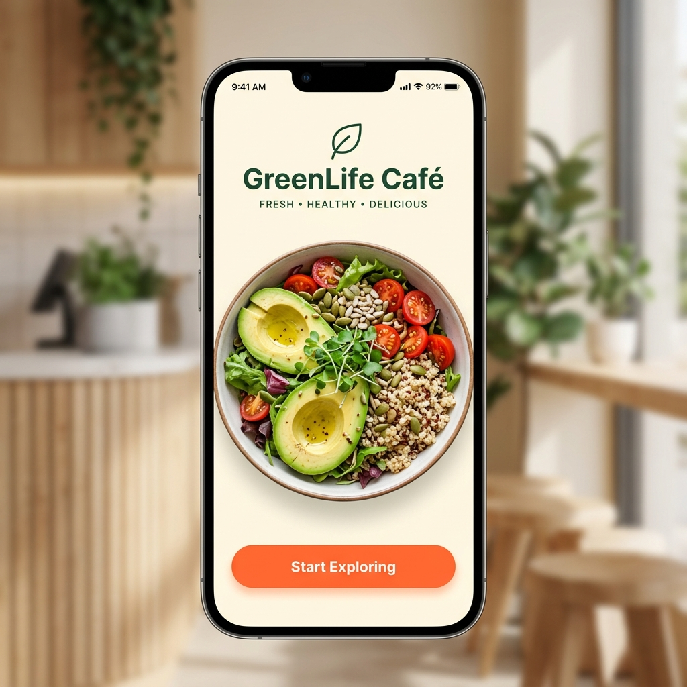
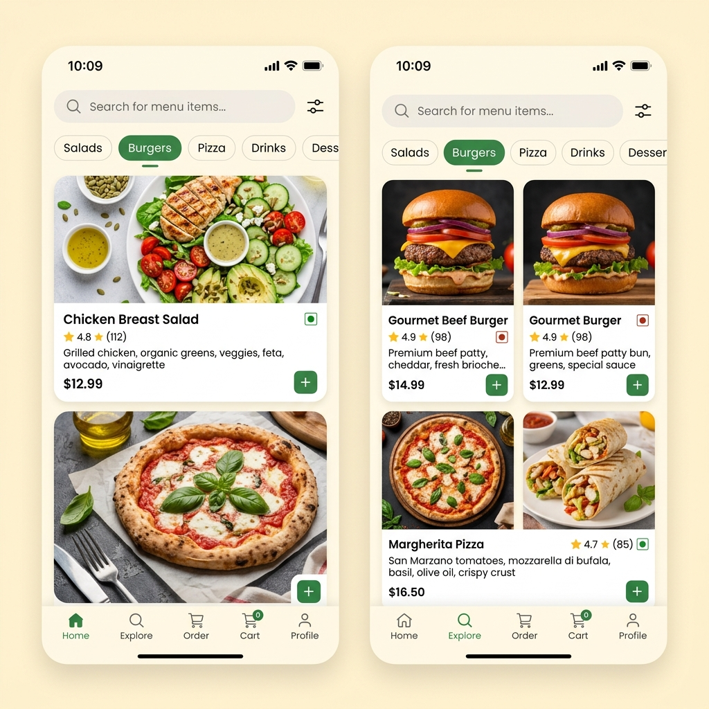
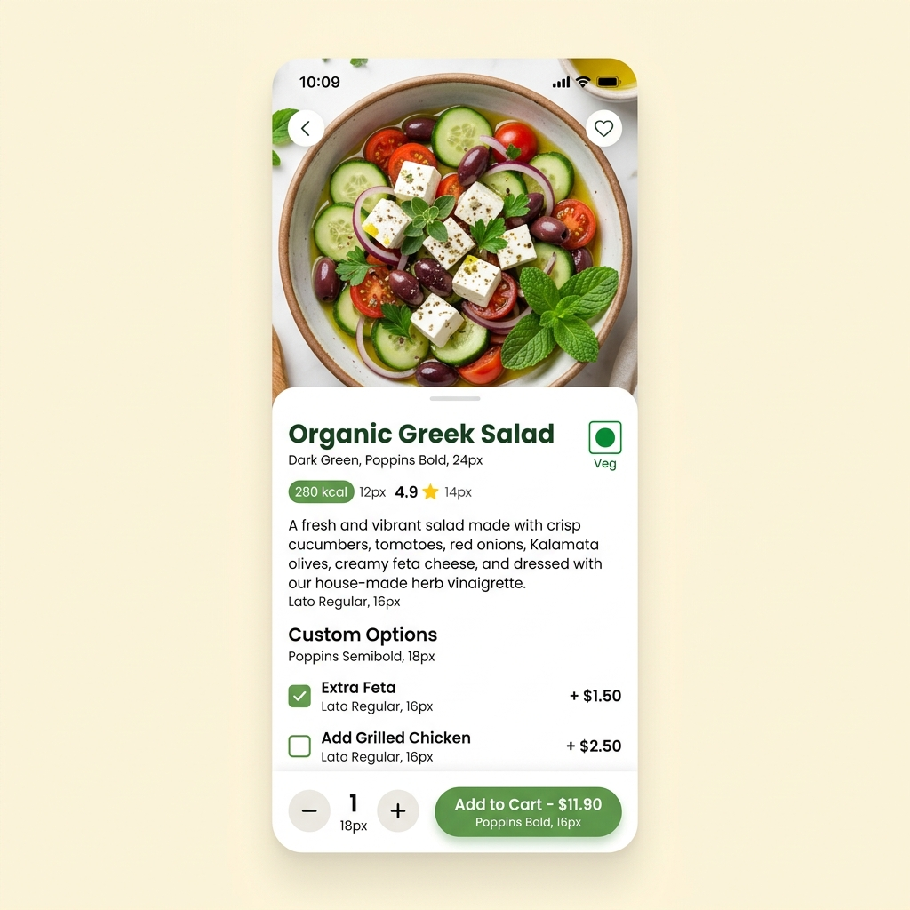
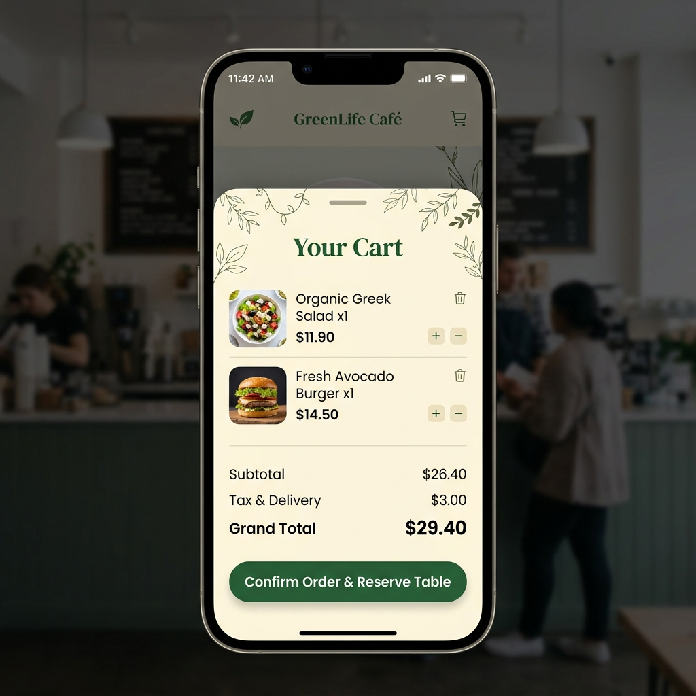
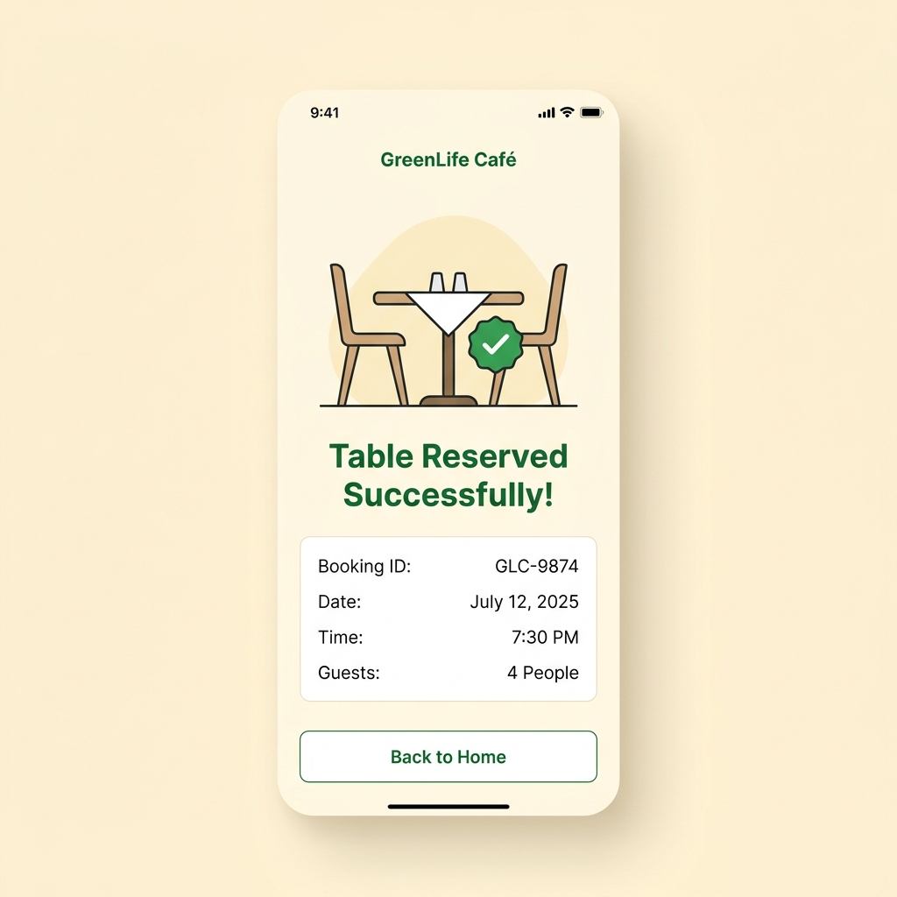

# 🍽️ Task 3 — Restaurant Menu UI Design

**A visually immersive, mobile-first restaurant menu app design featuring smooth category navigation, rich food cards, and an intuitive ordering experience.**

---

## 🎯 Objective

Design a modern, mouth-watering restaurant menu UI for a mobile app. The interface must make food discovery effortless, drive higher order values through visual appeal, and provide a seamless path from browsing to checkout.

---

## ✨ Features

- **Home Screen** — Hero banner with daily specials and category quick-access
- **Category Navigation** — Horizontal scrollable pill tabs for food categories
- **Menu Grid** — Appetizing food cards with imagery, pricing, and ratings
- **Item Detail Screen** — Full-bleed food photography with customization options
- **Cart Flow** — Slide-up cart panel with quantity controls and total calculation
- **Search & Filter** — Keyword search with dietary preference filters (Vegan, Gluten-Free)
- **Order Confirmation** — Receipt summary with estimated delivery time

---

## 🔄 Design Process

| Phase | Description |
|-------|-------------|
| **Research** | Analysis of top food delivery apps (Swiggy, Zomato, DoorDash, Uber Eats) |
| **User Flow** | Mapping the browse-to-order journey for minimum friction |
| **Wireframes** | Low-fidelity sketches exploring card layouts and navigation patterns |
| **Visual Design** | High-fidelity screens with warm color palette and food photography |
| **Prototyping** | Interactive Figma prototype with scroll animations and transitions |
| **Usability Review** | Heuristic evaluation for touch targets, readability, and flow clarity |

---

## 🛠️ Tools Used

| Tool | Purpose |
|------|---------|
| **Figma** | UI Design, Prototyping, Component System |
| **Unsplash** | High-quality food photography sourcing |
| **Stark Plugin** | Accessibility & Contrast Checking |
| **FigJam** | User Flow Diagramming |

---

## 📸 Screenshots

> Add your screen captures below. Place PNG/JPG files in the `Screenshots/` folder.

| Screen | Preview |
|--------|---------|
| Home |  |
| Menu |  |
| Item Detail |  |
| Cart |  |
| Checkout |  |

---

## 🔗 Figma Link

> 📎 Open the live Figma prototype:
> 
> **[View Figma File →]()**
> 
> *(Replace with your actual Figma share link)*

See also: [`Figma-Link.txt`](./Figma-Link.txt)

---

## 👤 Author

| Detail | Info |
|--------|------|
| **Name** | Noor Mohamed Halith |
| **Program** | CODSOFT UI/UX Design Internship |
| **Task** | Task 3 — Restaurant Menu UI Design |

---

*CODSOFT UI/UX Internship · Task 3*

